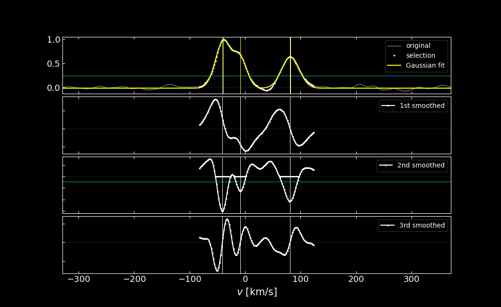

## `doe` Detection Of Extrema 

Version: 2.0 

Contact: tmerle@ulb.ac.be 

Reference: [Merle et al. (2017)](https://ui.adsabs.harvard.edu/abs/2017A%26A...608A..95M/abstract)

Goal: `doe` is a command line tool written in Python3 designed to detect and fit (blended) components in cross-correlation function (CCF) of stellar spectra with templates. It can also be used directly to detect absorption lines in normalized stellar spectra. 

---

## Overview

In brief, `doe` takes as input the CCF of a given spectrum and returns the number of peaks present in the CCF. To this end, `doe` computes the first, second and third derivatives of the CCF by convolving it with, respectively, the first, second and third derivative of a narrow Gaussian kernel. This technique allows us to differentiate the CCFs and smooth them simultaneously, which avoid the numerical noise that may appear when one does discrete differentiation. Then, `doe` looks for ascending zeros of the third derivative, i.e., inflection points (or local minima of the second derivative), to disentangle the CCF components. The CCF is then fitted by a multi-Gaussian function over a small range around the local maxima and/or inflection points in order to obtain the velocity of the identified peaks. Several model mixture functions can be use to fit the CCF: Gaussian, Lorentzian, Voigtian and rotational profile are available.

---

## Quick start

### Help

To see a description of all the command line options (general behaviour, code, fitting and graphical parameters): 

> doe.py -h 

### Code I/O

- **Input**:  one dat (for a CCF) or fits (for a spectrum) input file  (unicode file with 2 columns [abscissa ordinates] or FITS file (with CRVAL1 and CDELT1 keywords))
- **Outputs**:
  -  *_sd.dat  (selected successives derivatives [abscissa ordinates 1st 2nd 3rd])
  -  *_xp.dat  (peaks properties [x x_err f width xwmin xwmax sigma it]
                     if in addition, a fit of the components is performed, then:
                        with -G option: [x x_err f width xwmin xwmax sigma it, Gaussian fit (mu, mu_err, sigma, n) + offset] 
                        with -L option: [x x_err f width xwmin xwmax sigma it, Lorentzian fit (mu, mu_err, gamma, n) + offset]
                        with -V option: [x x_err f width xwmin xwmax sigma it, Voigtian fit (mu, mu_err, alpha, gamma, n) + offset]
                        with -R option: [x x_err f width xwmin xwmax sigma it, rotational fit (mu, mu_err, epsilon, vsini, n) + offset]
  -  *.pdf     (if -p or -pp is given, plot of the CCF and its successive derivatives)

Some synthetic CCF have been generated with the `ccfgen.py` in the `ccfgen` directory and may constitues input CCF for testing `doe`.
Three simulated CCF are provided with 3 components at $-40$, $-10$ an $80$ km/s and for 3 resolving power $R$ = 20000, 40000 and 60000.

### Detection of peaks

One argument is mandatory when invoking `doe.py`: the input filename of the CCF or the spectrum
> doe.py ccfgen/ccfgen_20000.dat -pp

The `-pp` option allows to display an interactive control plot.
The `-v` mmay be used to make `doe` more verbose.

### Fit the detected peaks
To do

### The 3 main options to optimize detection (`-c`, `-d` an `-s`)
To do

---

## Refereed publications using `doe`
- Van der Swaelmen et al. 2023, accepted in A&A
- [Merle et al. 2022, Nature Astronomy, 6, 681](https://rdcu.be/cNqC2)
- [Traven et al. 2020, A&A,638, 145](https://ui.adsabs.harvard.edu/abs/2020A%26A...638A.145T/abstract)
- [Merle et al. 2020, A&A, 635, 155](https://ui.adsabs.harvard.edu/abs/2020A%26A...635A.155M/abstract)
- [Kravchenko et al. 2019, A&A, 632, 28](https://ui.adsabs.harvard.edu/abs/2019A%26A...632A..28K/abstract) 
- [Merle et al. 2017, A&A, 608, 95](https://ui.adsabs.harvard.edu/abs/2017A%26A...608A..95M/abstract)

---

## Dependencies

Excepted the standard library, `doe` relies on:
- numpy
- scipy
- matplotlib

