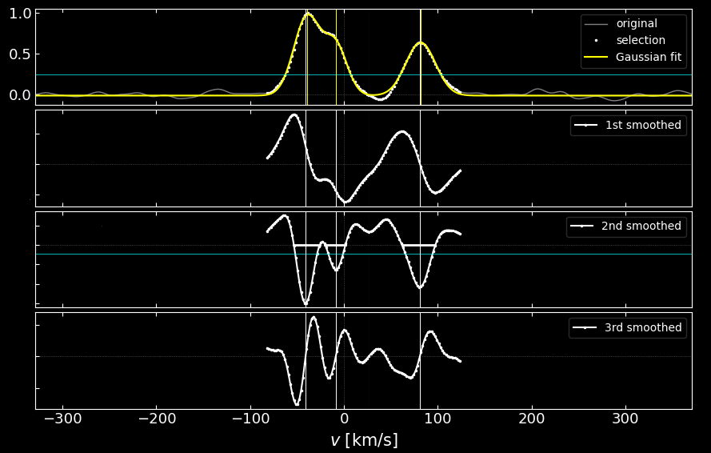

# `doe` — Detection Of Extrema

[](https://www.python.org/)
[](https://github.com/thibaultmerle/doe)
[](https://www.gnu.org/licenses/gpl-3.0)



`doe` is a command line tool written in Python 3 designed to detect and fit (blended) components in the **Cross-Correlation Function (CCF)** of stellar spectra with templates. It can also be used directly to detect absorption lines in normalized stellar spectra.

---

## Table of Contents
- [Overview](#overview)
- [Installation](#installation)
- [Quick Start](#quick-start)
- [I/O Formats](#io-formats)
- [Advanced Options](#advanced-options)
- [Publications](#refereed-publications-using-doe)
- [Dependencies](#dependencies)
- [License](#license)

---

## Overview

In brief, `doe` takes as input the CCF of a given spectrum and returns the number of peaks present. It computes the first, second, and third derivatives of the CCF by convolving it with a narrow Gaussian kernel. This technique allows for simultaneous smoothing and differentiation, avoiding the numerical noise typical of discrete differentiation. 

The tool disentangles CCF components by identifying inflection points (local minima of the second derivative). The CCFs are then fitted using model mixture functions (Gaussian, Lorentzian, Voigtian, or Rotational) over a small range around the local maxima and/or inflection points to obtain precise velocities.

- **Reference**: [Merle et al. (2017)](https://ui.adsabs.harvard.edu/abs/2017A%26A...608A..95M/abstract)
- **Contact**: [tmerle@ulb.ac.be](mailto:tmerle@ulb.ac.be)

---

## Installation

To use `doe`, clone the repository and ensure you have the required dependencies:

```bash
git clone https://github.com/thibaultmerle/doe.git
cd doe
```

Ensure Python 3 is installed along with the following libraries:
```bash
pip install numpy scipy matplotlib
```

---

## Quick Start

### 1. Help & Usage
To see a description of all command-line options (fitting, graphical parameters, etc.):
```bash
python doe.py -h
```

### 2. Basic Detection
Run `doe` on a sample CCF from the `ccfgen` directory:
```bash
python doe.py ccfgen/R20k_3comp.dat -pp
```
*The `-pp` option displays an interactive control plot.*

### 3. Fitting Peaks
To fit a model mixture function made of Gaussians, use the `-G` option:
```bash
python doe.py ccfgen/R20k_3comp.dat -pp -G
```
Other profiles: `-L` (Lorentzian), `-V` (Voigtian), and `-R` (Rotational).

---

## I/O Formats

### Input
`doe` accepts the following input formats:
- **.dat**: ASCII file with 2 columns (abscissa, ordinates).
- **.fits**: FITS file with `CRVAL1` and `CDELT1` keywords (standard for spectra).
- **.npy**: NumPy binary format (supported since v2.1).

### Output
The tool generates several output files depending on the options:
| File Extension | Description |
| :--- | :--- |
| `*_sd.dat` | Selected successive derivatives (abscissa, 1st, 2nd, 3rd). |
| `*_xp.dat` | Peak properties: position, error, flux, width, etc. |
| `*.pdf` | Control plot (if `-p` or `-pp` is used). |

---

## Advanced Options

Optimize component detection using these three parameters:

| Option | Parameter | Description |
| :--- | :--- | :--- |
| `-c` | **Threshold** | Horizontal threshold on the CCF [0, 1] to filter noise. |
| `-s` | **Broadening** | Smoothing kernel width in km/s (Default: 3 × velocity step). |
| `-d` | **2nd Deriv.** | Selection threshold for second derivative minima [0, 1]. |

**Example: Detecting blended components**
If a default run only finds 2 peaks, try narrowing the kernel:
```bash
python doe.py ccfgen/R40k_3comp.dat -s 4
```

---

## Refereed Publications using `doe`

`doe` has been used in several peer-reviewed studies:

- [Van der Swaelmen et al. 2023, A&A](https://ui.adsabs.harvard.edu/abs/2023arXiv231204721V/abstract)
- [Merle et al. 2022, Nature Astronomy, 6, 681](https://rdcu.be/cNqC2)
- [Traven et al. 2020, A&A, 638, 145](https://ui.adsabs.harvard.edu/abs/2020A%26A...638A.145T/abstract)
- [Merle et al. 2020, A&A, 635, 155](https://ui.adsabs.harvard.edu/abs/2020A%26A...635A.155M/abstract)
- [Kravchenko et al. 2019, A&A, 632, 28](https://ui.adsabs.harvard.edu/abs/2019A%26A...632A..28K/abstract)
- [Merle et al. 2017, A&A, 608, 95](https://ui.adsabs.harvard.edu/abs/2017A%26A...608A..95M/abstract)

---

## Dependencies

- **Python 3.x**
- **NumPy**
- **SciPy**
- **Matplotlib**

---

## License

This project is licensed under the **GNU General Public License v3.0** - see the `LICENSE` file for details.

